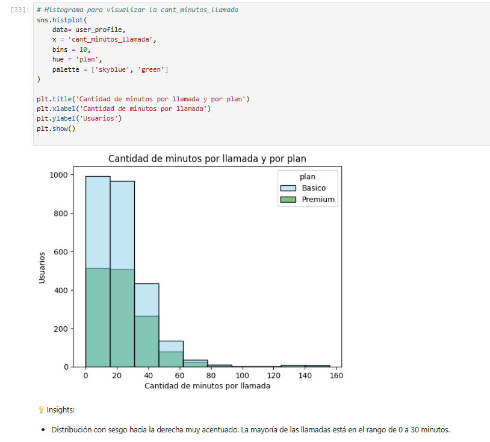
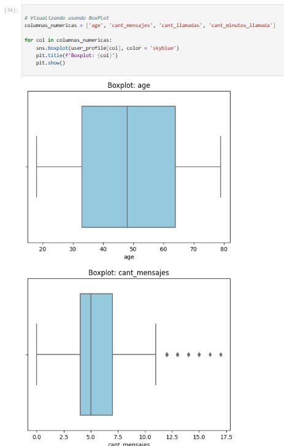
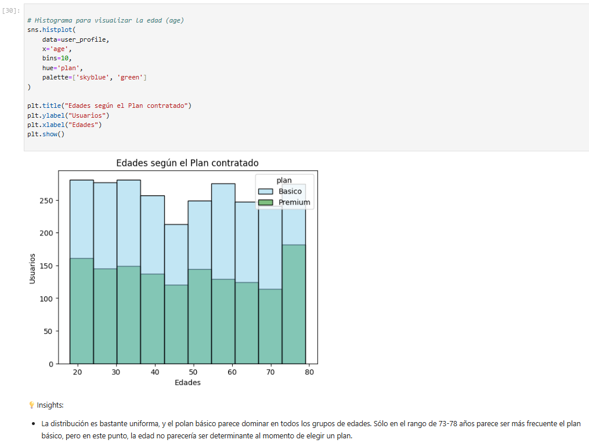

# 📱 ConnectaTel Mobile Usage & Customer Segmentation Analysis

This project analyzes customer mobile usage behavior for **ConnectaTel**, a telecommunications company operating in **Mexico and Colombia**.

The objective was to understand how customers actually use mobile services (calls and messages), identify usage patterns, detect atypical behavior, and explore how different customer segments may require differentiated commercial strategies.

The analysis was performed using **Python** and combines **data cleaning, exploratory data analysis, statistical profiling, outlier detection, segmentation, and business insights generation**.

---

## 📌 Business Questions

The project aimed to answer the following business questions:

- Which customer segments show higher or lower usage of calls and messages?
- Which users present atypical behavior that may indicate fraud, errors, or unusual consumption?
- How does mobile usage vary according to age and subscribed plan?
- Which behavioral patterns can support better plan design and customer satisfaction?

---

## 🛠 Tools & Technologies

- Python
- Pandas
- NumPy
- Seaborn
- Matplotlib
- Jupyter Notebook

---

## 🔍 Project Workflow

### 1. Data Loading & Exploration

Three datasets were integrated and analyzed:

- `plans.csv` → pricing and mobile plans
- `users_latam.csv` → customer information
- `usage.csv` → calls and messaging activity

Initial exploration included:

- dataset dimensions
- column types
- missing values
- potential inconsistencies

---

### 2. Data Quality & Cleaning

Data quality issues were identified and treated, including:

- missing values
- sentinel values
- inconsistent age values
- date standardization
- null handling
- categorical cleaning

This ensured a reliable dataset for analysis.

---

### 3. Statistical Profiling

Usage behavior was analyzed through descriptive statistics, including:

- call duration
- message volume
- message length
- customer age
- plan type

This allowed identification of typical and extreme customer behavior patterns.

---

### 4. Outlier Detection & Visualization

Histograms and boxplots were used to identify atypical customer behavior and extreme usage patterns.

Outliers were analyzed within a business context to distinguish between:

- data quality issues
- unusual behavior
- high-value intensive users

---

### 5. Customer Segmentation

Customers were segmented based on:

- age group
- mobile usage level
- call behavior
- messaging activity
- plan subscription

This segmentation helped identify differentiated user profiles and commercial opportunities.

---
## 📊 Analysis Preview

### Call Usage Distribution

Distribution of customer call duration used to understand mobile usage behavior and detect skewed consumption patterns.

---

### Outlier Detection

Boxplot analysis used to identify atypical mobile usage behavior and distinguish potential data issues from high-value users.

---

### Customer Segmentation Analysis

Segmentation analysis showing behavioral differences between customer groups based on mobile consumption patterns.

---

## 📈 Key Insights

- Mobile usage patterns vary significantly between customer segments.
- Some outliers appear to represent real high-usage behavior rather than data errors.
- Customer age and plan type influence mobile consumption patterns.
- Segmentation provides opportunities for differentiated pricing and commercial strategies.

---

## 💡 Business Recommendations

- Design differentiated offers according to customer usage intensity.
- Monitor atypical users to identify potential fraud or high-value customers.
- Optimize plan offerings based on observed consumption patterns.
- Use segmentation to improve retention and customer satisfaction.

---

## 🎯 Key Skills Demonstrated

- Data Cleaning
- Exploratory Data Analysis (EDA)
- Outlier Detection
- Customer Segmentation
- Statistical Profiling
- Data Visualization
- Business Insights Development

---

## 📓 Notebook

The complete analysis is available in the Jupyter Notebook included in this repository.

---

## 🔗 Portfolio

- Notion Portfolio: https://www.notion.so/ConnectaTel-An-lisis-de-uso-m-vil-y-segmentaci-n-de-clientes-367ddeb97846804e849efcae9e9be4b4?source=copy_link
